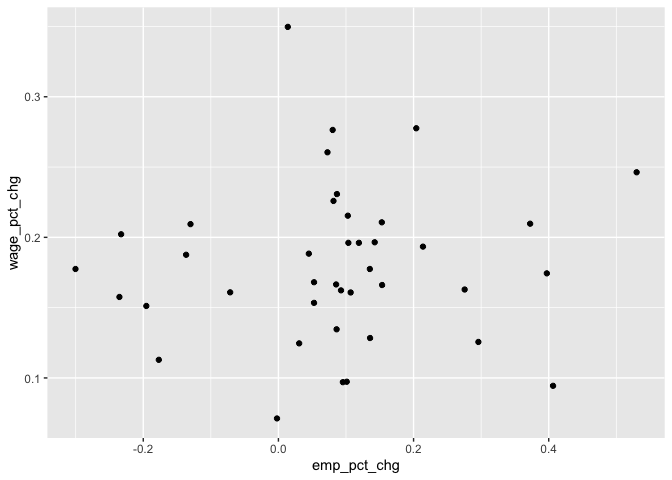

## Introduction

The Center for Disease Control and Prevention (CDC), through the National Center for Health Statistics ([NCHS](https://www.cdc.gov/nchs/hus/data-finder.htm)), released data about 
health care employment and wages within the United States between 2000-2020. The selected occupations range between two categories of *health care practitioners and technical* roles such as physician assistants and pharmacy technicians and *health care support* roles such as nursing assistants and psychiatric aides. 

Employment figures are number of filled positions. This includes both full- and part-time wage and salary positions. Estimates do not include the self-employed, owners and partners in unincorporated firms, household workers, or unpaid family workers. This data excludes occupations such as dentists, physicians, and chiropractors, which have a large percentage of workers who are self-employed. Wages reported is calculated as a mean hourly wage rate for an occupation, where the total wages that all workers in the occupation earn in an hour divided by the total number of employees in the occupation.   

**Data Source:** [Table HCEmpl](https://ftp.cdc.gov/pub/Health_Statistics/NCHS/Publications/Health_US/hus20-21tables/hcempl.xlsx)

After tidying up the Excel file into long format, the analysis will look to see if there is a relationship between the percentage change of employment versus the percentage change of mean hourly wages.   

---

## Required Libraries


```r
library(tidyverse)
library(rio)
library(janitor)
```

---

## Import Data

To import the data into R, the *rio* library allows it to read a URL that directly links to an Excel file and transform it into a data frame 


```r
url <- 'https://ftp.cdc.gov/pub/Health_Statistics/NCHS/Publications/Health_US/hus20-21tables/hcempl.xlsx'
data = import(url)

knitr::kable(head(data, 3))
```


|Table HCEmpl. Health care employment and wages, by selected occupations: United States, selected years 2000–2020                         |...2         |...3 |...4 |...5 |...6 |...7 | ...8|...9                         |...10 |...11 |...12 |...13 |...14 | ...15|
|:----------------------------------------------------------------------------------------------------------------------------------------|:------------|:----|:----|:----|:----|:----|----:|:----------------------------|:-----|:-----|:-----|:-----|:-----|-----:|
|Excel version (with more data years and standard errors when available): https://www.cdc.gov/nchs/hus/contents2020-2021.htm#Table-HCEmpl |NA           |NA   |NA   |NA   |NA   |NA   |   NA|NA                           |NA    |NA    |NA    |NA    |NA    |    NA|
|[Data are based on a semiannual survey of nonfarm establishments]                                                                        |NA           |NA   |NA   |NA   |NA   |NA   |   NA|NA                           |NA    |NA    |NA    |NA    |NA    |    NA|
|NA                                                                                                                                       |Employment\1 |NA   |NA   |NA   |NA   |NA   |   NA|Mean hourly wage (dollars)\2 |NA    |NA    |NA    |NA    |NA    |    NA|

---

## Drop Non-Data Rows

Removing rows that does not provide figures from the table. Along with the *janitor* library, it can take a specific row and use it as the column headers, while also cleaning their names to a more appropriate syntax.  


```r
updated_data <- 
  data |> 
  filter(!row_number() %in% c(1:3, 49:51)) |>     # drop non-data rows
  row_to_names(row_number = 1) |>         # first row as column names
  clean_names()               # clean names
  
knitr::kable(head(updated_data, 3))
```


|   |occupation_title                                    |x2000 |x2005 |x2009 |x2010 |x2015 |x2016 | x2020|x2000_2            |x2005_2            |x2009_2 |x2010_2 |x2015_2 |x2016_2            | x2020_2|
|:--|:---------------------------------------------------|:-----|:-----|:-----|:-----|:-----|:-----|-----:|:------------------|:------------------|:-------|:-------|:-------|:------------------|-------:|
|2  |Health care practitioners and technical occupations |NA    |NA    |NA    |NA    |NA    |NA    |    NA|NA                 |NA                 |NA      |NA      |NA      |NA                 |      NA|
|3  |Audiologists                                        |11530 |10030 |12590 |12860 |12070 |12310 | 13300|22.92              |27.72              |32.14   |33.58   |37.22   |38.119999999999997 |    42.9|
|4  |Cardiovascular technologists and technicians        |40080 |43560 |48070 |48720 |51400 |53760 | 55980|16.809999999999999 |19.989999999999998 |23.91   |24.38   |26.97   |27.45              |    29.3|

---

## Subset Employment Figures

These next two sections subsets the data into two data frames that focus on employment and wage figures. This allows the data to be easily pivoted separately from multiple year columns into one long-format standard.


```r
updated_employment <- 
  updated_data |> 
  select(c(1:8)) |> 
  gather('year', 'employment', -c('occupation_title')) |> 
  rename(occupation = occupation_title)

updated_employment$year <- 
  updated_employment$year |> 
  parse_number()

knitr::kable(head(updated_employment, 3))
```


|occupation                                          | year|employment |
|:---------------------------------------------------|----:|:----------|
|Health care practitioners and technical occupations | 2000|NA         |
|Audiologists                                        | 2000|11530      |
|Cardiovascular technologists and technicians        | 2000|40080      |

---

## Subset Mean Hourly Wage Figures


```r
updated_wages <- 
  updated_data |> 
  select(c(1, 9:15)) |> 
  gather('year', 'mean_hourly_wage', -c('occupation_title')) |> 
  rename(occupation = occupation_title, mean_wage = mean_hourly_wage)

updated_wages$year <- 
  updated_wages$year |> 
  parse_number()

knitr::kable(head(updated_wages, 3))
```


|occupation                                          | year|mean_wage          |
|:---------------------------------------------------|----:|:------------------|
|Health care practitioners and technical occupations | 2000|NA                 |
|Audiologists                                        | 2000|22.92              |
|Cardiovascular technologists and technicians        | 2000|16.809999999999999 |

---

## Join Employment and Wage Figures

Here, the data is joined back together, where year has its own unique column and we have the figures to compare a year and occupation easier. 


```r
employment_wages <-
  inner_join(updated_employment, updated_wages)

knitr::kable(head(employment_wages, 3))
```


|occupation                                          | year|employment |mean_wage          |
|:---------------------------------------------------|----:|:----------|:------------------|
|Health care practitioners and technical occupations | 2000|NA         |NA                 |
|Audiologists                                        | 2000|11530      |22.92              |
|Cardiovascular technologists and technicians        | 2000|40080      |16.809999999999999 |

---

## Occupation Names and Figures

Some of the occupation names have special characters and numbers as seen below. 


```r
knitr::kable(employment_wages[11:16, 1])
```


|x                                                                                                      |
|:------------------------------------------------------------------------------------------------------|
|Magnetic resonance imaging technologists\3                                                             |
|Medical dosimetrists, medical records specialists, and health technologists and technicians, all other |
|Nuclear medicine technologists                                                                         |
|Nurse anesthetists\4                                                                                   |
|Nurse midwives\4                                                                                       |
|Nurse practitioners\4                                                                                  |

The *employment_wages* table is cleaned up removing unwanted characters and type casting integer and float values where appropriate


```r
employment_wages <- 
  employment_wages |> 
  mutate(occupation = str_replace(occupation, "\\\\[:digit:]", "")) |>  # clean occupation titles
  mutate(employment = str_replace(employment, "[^[:alnum:]]+", "")) |>               # clean employment
  mutate(employment = as.integer(employment)) |> 
  mutate(mean_wage = str_replace(mean_wage, "[^[:alnum:]\\.]+", "")) |>     # clean wages
  mutate(mean_wage = as.numeric(mean_wage)) |> 
  drop_na(employment)   # drop rows that does not have any employment data

knitr::kable(head(employment_wages, 3))
```


|occupation                                   | year| employment| mean_wage|
|:--------------------------------------------|----:|----------:|---------:|
|Audiologists                                 | 2000|      11530|     22.92|
|Cardiovascular technologists and technicians | 2000|      40080|     16.81|
|Dental hygienists                            | 2000|     148460|     24.99|

---

## Calculate Year-to-Year Changes between Occupations

To calculate the percent change of employment and wage figures, the *lag()* function was used, grouping by *occupation_title*.  


```r
employment_wages <- 
  employment_wages |> 
  group_by(occupation) |>
  mutate(emp_delta = employment - lag(employment),
         wage_delta = mean_wage - lag(mean_wage), 
         emp_pct_chg = round(((employment - lag(employment)) / lag(employment)), 4),
         wage_pct_chg = round(((mean_wage - lag(mean_wage)) / lag(mean_wage)), 4)) |> 
  arrange(occupation)

knitr::kable(head(employment_wages))
```


|occupation   | year| employment| mean_wage| emp_delta| wage_delta| emp_pct_chg| wage_pct_chg|
|:------------|----:|----------:|---------:|---------:|----------:|-----------:|------------:|
|Audiologists | 2000|      11530|     22.92|        NA|         NA|          NA|           NA|
|Audiologists | 2005|      10030|     27.72|     -1500|       4.80|     -0.1301|       0.2094|
|Audiologists | 2009|      12590|     32.14|      2560|       4.42|      0.2552|       0.1595|
|Audiologists | 2010|      12860|     33.58|       270|       1.44|      0.0214|       0.0448|
|Audiologists | 2015|      12070|     37.22|      -790|       3.64|     -0.0614|       0.1084|
|Audiologists | 2016|      12310|     38.12|       240|       0.90|      0.0199|       0.0242|

## Changes Between Employment and Mean Hourly Wage Overall

Filtering for the highest increase in percentage change in wages for each occupation regardless of year, we can see that *Nuclear medicine technologists* had the largest wage percentage change at 34.97%. Does these maximum increases within each occupation relate to how many more people are being employed from previous years?


```r
top_occ <- 
  employment_wages |>
    filter(!is.na(emp_delta)) |> 
    group_by(occupation) |> 
    filter(wage_pct_chg == max(wage_pct_chg)) |> 
    arrange(desc(wage_pct_chg)) |> 
    select(occupation, emp_pct_chg, wage_pct_chg)

knitr::kable(top_occ)
```


|occupation                                        | emp_pct_chg| wage_pct_chg|
|:-------------------------------------------------|-----------:|------------:|
|Nuclear medicine technologists                    |      0.0139|       0.3497|
|Occupational therapy assistants                   |      0.2040|       0.2776|
|Pharmacists                                       |      0.0803|       0.2764|
|Radiologic technologists and technicians          |      0.0726|       0.2605|
|Massage therapists                                |      0.5301|       0.2463|
|Physical therapist assistants                     |      0.0866|       0.2308|
|Registered nurses                                 |      0.0815|       0.2259|
|Radiation therapists                              |      0.1027|       0.2154|
|Respiratory therapists                            |      0.1530|       0.2107|
|Diagnostic medical sonographers                   |      0.3725|       0.2097|
|Audiologists                                      |     -0.1301|       0.2094|
|Pharmacy aides                                    |     -0.2328|       0.2022|
|Speech-language pathologists                      |      0.1425|       0.1965|
|Cardiovascular technologists and technicians      |      0.1035|       0.1961|
|Occupational therapists                           |      0.1191|       0.1961|
|Physician assistants                              |      0.2139|       0.1934|
|Licensed practical and licensed vocational nurses |      0.0450|       0.1884|
|Recreational therapists                           |     -0.1366|       0.1876|
|Dietitians and nutritionists                      |      0.1353|       0.1775|
|Occupational therapy aides                        |     -0.3003|       0.1775|
|Pharmacy technicians                              |      0.3972|       0.1744|
|Opticians, dispensing                             |      0.0527|       0.1681|
|Dental hygienists                                 |      0.0854|       0.1665|
|Physical therapists                               |      0.1534|       0.1661|
|Medical equipment preparers                       |      0.2756|       0.1629|
|Nursing assistants                                |      0.0926|       0.1623|
|Medical transcriptionists                         |     -0.0714|       0.1609|
|Emergency medical technicians and paramedics      |      0.1069|       0.1608|
|Psychiatric aides                                 |     -0.2353|       0.1576|
|Nurse anesthetists                                |      0.0527|       0.1534|
|Psychiatric technicians                           |     -0.1955|       0.1512|
|Dental assistants                                 |      0.0861|       0.1346|
|Nurse midwives                                    |      0.1356|       0.1284|
|Medical assistants                                |      0.2959|       0.1256|
|Dietetic technicians                              |      0.0307|       0.1246|
|Orderlies                                         |     -0.1770|       0.1129|
|Physical therapist aides                          |      0.1011|       0.0973|
|Magnetic resonance imaging technologists          |      0.0954|       0.0970|
|Nurse practitioners                               |      0.4064|       0.0944|
|Clinical laboratory technologists and technicians |     -0.0021|       0.0712|

## Employee Rate Change vs. Wage Percentage Change

Plotting these changes, we can see that there is not a relationship where as employee rates increase, so does wages. 


```r
top_occ |> 
  ggplot(aes(x = emp_pct_chg, y = wage_pct_chg)) +
  geom_point(stat = 'identity') 
```

<!-- -->
